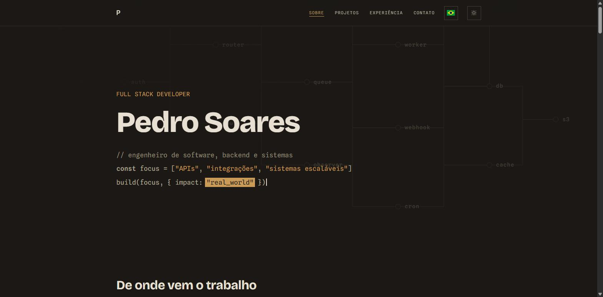
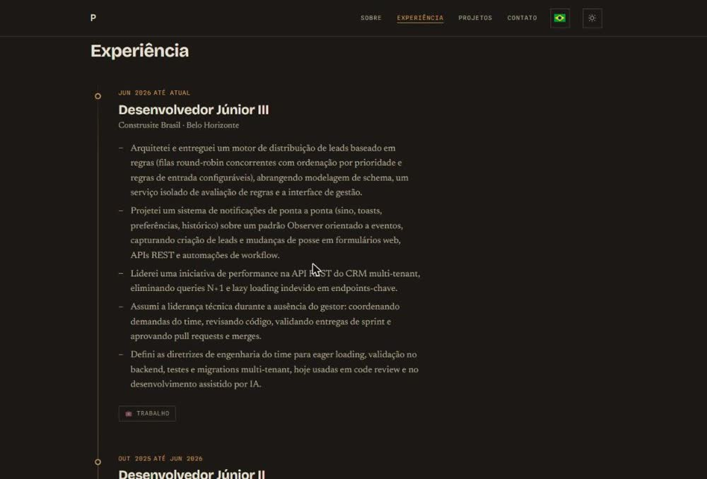
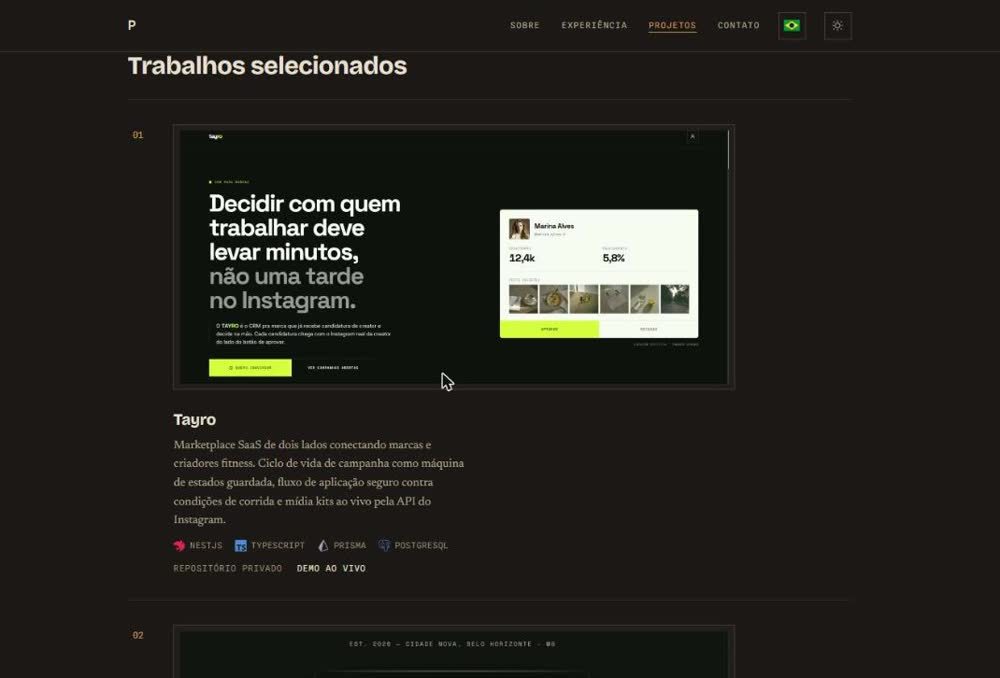
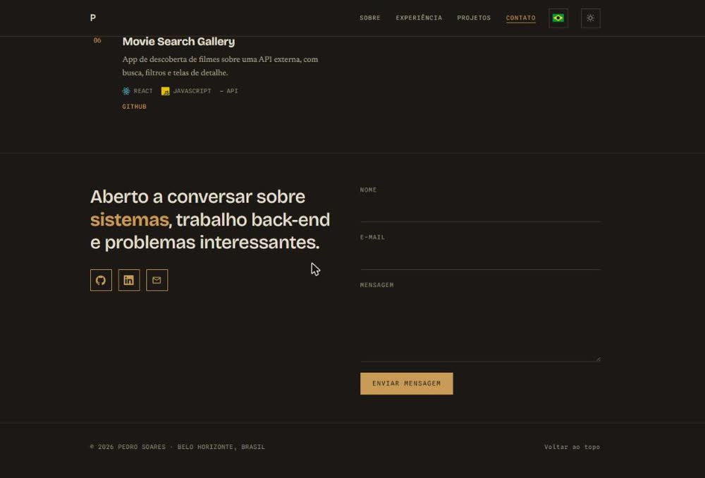

# Portfólio Profissional — Pedro Soares de Souza Garcia

https://pedrossgarcia.com.br/

Portfólio pessoal desenvolvido como projeto acadêmico das sprints de **Engenharia de Software da PUC Minas**. O site é um _single-page_ bilíngue (PT/EN) que apresenta a trajetória de **Pedro Soares**, desenvolvedor full-stack com foco em back-end e sistemas, em Belo Horizonte, organizado em quatro áreas de conteúdo: **Sobre**, **Experiência**, **Projetos** e **Contato**.

O visual segue a direção **"The Engineer's Ledger"**: um mundo editorial _warm-dark_ (fundo marrom-escuro `#1B1815`, um único acento em latão `#C99B57`), estruturado por tipografia e fios de 1px — sem cards, sombras ou gradientes decorativos. Um tema claro (papel de pedra quente, acento azul-nanquim) é acessível pelo _toggle_ de tema no cabeçalho.

---

## Visão geral

O objetivo é um site moderno, responsivo e de fácil manutenção, servindo como vitrine profissional e como entrega avaliável contra o rubric das sprints.

### Principais características

- **Quatro áreas de conteúdo** em _single-page_ com navegação por âncoras e _scroll-spy_: Sobre (`#about`), Experiência (`#experience`), Projetos (`#projects`), Contato (`#contact`).
- **Layout com cabeçalho fixo, área de conteúdo e rodapé.** O cabeçalho tem menu mobile em _overlay_, _toggle_ de tema (sol/lua) e _toggle_ de idioma (bandeira BR/US).
- **Internacionalização PT/EN** com o idioma escolhido **persistido** em `localStorage` (`portfolio-language`); `<html lang>` e `<title>` acompanham o idioma ativo. Padrão: **pt-BR**.
- **Tema claro/escuro** persistido em `localStorage` (`portfolio-theme`).
- **Responsividade** para desktop, tablet e mobile; contraste WCAG AA nos dois temas.
- **Formulário de contato com validação _inline_ em tempo real** (no _blur_ e no envio): nome, e-mail (formato) e mensagem (tamanho mínimo), com mensagens de erro sob cada campo, `aria-invalid`/`aria-describedby` e foco no primeiro campo inválido. O envio faz `POST` de JSON para `/api/contact`, uma _serverless function_ na Vercel que revalida os dados, descarta _honeypot_ e envia o e-mail via **Resend**.
- **Conteúdo centralizado em arquivos de dados** (`src/data/*.js` e `src/i18n/ui.js`), para atualizar textos sem tocar nos componentes.
- **Movimento respeitando `prefers-reduced-motion`.**

---

## Tecnologias

| Camada | Tecnologia | Motivo |
|--------|-----------|--------|
| Biblioteca UI | [Vue 3](https://vuejs.org/) (`<script setup>`) | Componentes declarativos e reativos. |
| Build / dev server | [Vite 6](https://vitejs.dev/) | Dev server rápido com HMR e build otimizado. |
| Roteamento | [Vue Router 4](https://router.vuejs.org/) | Rota única hoje; pronto para expansão. |
| Estilos | [Tailwind CSS 3](https://tailwindcss.com/) + PostCSS | Utilitários pontuais sobre _design tokens_ em CSS custom properties (`src/assets/styles/main.css`). |
| Tipografia | Bricolage Grotesque · Newsreader · Spline Sans Mono, via [`@fontsource`](https://fontsource.org/) | _Self-hosted_, sem requisição a terceiros. Grotesca para display, serifada para leitura, monoespaçada para dados e o bloco de código do hero. |
| Ícones | [simple-icons](https://simpleicons.org/) (pacote de dados, _tree-shaken_) | Marcas coloridas das tecnologias nos cards de projeto. |
| i18n | Composable próprio (`useLanguage` + `src/i18n/ui.js`) | Leve, no estilo do projeto; sem dependência de biblioteca. |
| Formulário de contato | _Serverless function_ `api/contact.js` + [Resend](https://resend.com/) | Valida no servidor e envia o e-mail; sem backend próprio. |
| Deploy | [Vercel](https://vercel.com/) | Hospedagem com CI/CD, preset Vite, _rewrite_ SPA e Functions (`vercel.json`). |

> A primeira sprint focou no front-end estático. Internacionalização, validação _inline_ do formulário e vínculo de `<html lang>` foram entregues na sprint de _hardening_. A hospedagem migrou de Netlify para Vercel.

---

## Estrutura do projeto

```text
.
├── index.html                     # Entry HTML + contrato de direção (comentário)
├── vite.config.js                 # Config do Vite + alias "@" → src/
├── tailwind.config.js             # Tema mapeado para as CSS vars
├── vercel.json                    # rewrite SPA (rotas não-/api → /index.html)
├── .env.example                   # RESEND_API_KEY, CONTACT_FROM (copiar para .env)
├── api/
│   └── contact.js                 # Serverless function: valida o formulário e envia via Resend
└── src/
    ├── main.js                    # Bootstrap (createApp + router), imports de fonte, CSS global
    ├── App.vue                    # Layout raiz: TheNavbar + <router-view> + TheFooter
    ├── router/index.js            # Rota única "/" → HomeView; scrollBehavior com âncoras
    ├── views/HomeView.vue         # Compõe as seções: Hero, About, Experience, Projects, Contact
    ├── assets/
    │   ├── img/                   # Foto pessoal e screenshots de projetos
    │   └── styles/main.css        # Design tokens (:root + [data-theme="light"]) + classes compartilhadas
    ├── i18n/ui.js                 # Dicionário { en, pt } das strings de interface (nav, títulos, formulário, erros)
    ├── components/
    │   ├── TheNavbar.vue          # Nav fixa, scroll-spy, menu mobile, toggle de tema e de idioma
    │   ├── TheFooter.vue          # Rodapé: linha mono + "Voltar ao topo"
    │   ├── HeroSection.vue        # Cena de editor de código (linha de cargo, nome, bloco de código que se digita, cursor)
    │   ├── AboutSection.vue       # Bio + grade de tecnologias (SkillBadge)
    │   ├── ExperienceSection.vue  # Timeline vertical (trabalho + formação)
    │   ├── ProjectsSection.vue    # Projetos em destaque (com screenshot) + ledger 2-colunas
    │   ├── ContactSection.vue     # Canais + formulário com validação inline (POST para /api/contact)
    │   ├── TimelineItem.vue       # Um item da timeline de experiência
    │   ├── SkillBadge.vue         # Chip de tecnologia (emoji + nome)
    │   ├── FlagIcon.vue           # Bandeira BR/US desenhada em SVG, para o toggle de idioma
    │   └── TechIcon.vue           # Glyph de marca colorido + nome, para as tags de tecnologia dos projetos
    ├── composables/
    │   ├── useColorMode.js            # Estado do tema + persistência
    │   ├── useLanguage.js             # Estado do idioma + persistência + <html lang>/<title> + t(chave, vars)
    │   ├── useContent.js              # Conteúdo editorial reativo ao idioma ativo
    │   ├── useActiveSection.js        # Scroll-spy determinístico
    │   └── useIntersectionObserver.js # Uma revelação de 0.6s por seção
    └── data/
        ├── profile.js             # profileContent { en, pt }: nome, hero, prosa do Sobre, canais de contato
        ├── experience.js          # experienceContent { en, pt }: cargos + formação
        ├── projects.js            # projectsContent { en, pt }: projetos (título/descrição/techs/links/screenshot)
        └── skills.js              # skillsContent { en, pt }: { nome, icon }
```

---

## Protótipos de interface

### 1. Sobre (`#about`)

Hero como uma cena de editor de código (nome, cargo e a frase de posicionamento em código), seguido da bio narrativa (Vancouver → Belo Horizonte) e da grade de tecnologias.



### 2. Experiência (`#experience`)

Timeline vertical com o histórico profissional na Construsite Brasil (estágio → Desenvolvedor Júnior III) e a formação (PUC Minas, Tamwood International College).



### 3. Projetos (`#projects`)

Projetos em destaque abrem com um screenshot da _landing_; os demais seguem em um _ledger_ de duas colunas. Cada entrada traz descrição, tecnologias (com ícone da marca) e links para repositório e demo.



### 4. Contato (`#contact`)

Canais de contato (GitHub, LinkedIn, e-mail) e o formulário com validação _inline_ (envio por `POST` para `/api/contact`).



---

## Como rodar localmente

Requisitos: [Node.js](https://nodejs.org/) 22+

```bash
# Instale as dependências
npm install

# Servidor de desenvolvimento
npm run dev            # http://localhost:5173

# Build de produção e preview
npm run build          # → dist/
npm run preview
```

O `npm run dev` serve só o front-end; o formulário de contato precisa da função
`api/contact.js`. Para exercitá-la localmente, copie `.env.example` para `.env`,
preencha `RESEND_API_KEY` e `CONTACT_FROM`, e rode `vercel dev` (Vercel CLI) no
lugar de `npm run dev`. As mesmas variáveis devem existir no projeto na Vercel.

---

## Autor

**Pedro Soares de Souza Garcia**

[GitHub](https://github.com/pssgarcia) · [LinkedIn](https://www.linkedin.com/in/pedro-soares-b996a5263/)
